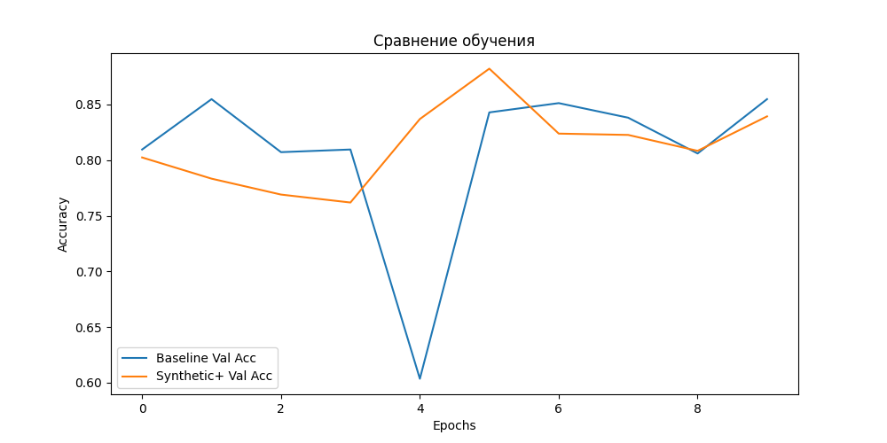

## HW 2.5

В этом проекте исследуется влияние синтетических данных, сгенерированных с помощью **Stable Diffusion** и **ControlNet (Canny)**.

В качестве датасета использовался **Flowers Recognition** (5 классов: tulip, rose, sunflower, dandelion, daisy)(https://www.kaggle.com/datasets/alxmamaev/flowers-recognition/data).

## Структура проекта

```text
.
├── data/                   # Датасеты (Train/Val/Synthetic)
├── generator.py            # Скрипт генерации (SD + ControlNet)
├── train.py                # Скрипт обучения модели
├── main.py                 # Основной пайплайн (генерация -> обучение -> сравнение)
├── split_data.py           # Скрипт для разделения Kaggle-датасета
├── requirements.txt        # Зависимости
└── README.md               # Описание проекта
```

## Установка и Запуск

1. **Установка зависимостей:**
   ```bash
   pip install -r requirements.txt
   ```

2. **Подготовка данных:**
   Скачайте датасет Flowers с Kaggle и разделите его на Train/Val:
   ```bash
   # (Предварительно настройте kaggle.json)
   kaggle datasets download -d alxmamaev/flowers-recognition
   unzip flowers-recognition.zip -d data/
   python split_data.py
   ```

3. **Запуск эксперимента:**
   Скрипт сгенерирует синтетику, обучит Baseline и Augmented модели, сохранит график.
   ```bash
   python main.py
   ```

---

## 🛠 Методология генерации

Для создания синтетических примеров использовался пайплайн **Stable Diffusion v1.5 + ControlNet (Canny)**.

### Проблема: "Галлюцинации" (Насекомые)
На исходных фото часто присутствовали насекомые (пчелы, жуки). ControlNet выделял их контуры, и модель пыталась рисовать "гибриды" цветов и насекомых.

### Решение
1. **Препроцессинг:** Применение `Gaussian Blur` перед созданием карты Canny. Это сгладило мелкие детали (лапки, усики), оставив только крупные формы лепестков.
2. **Negative Prompting:** В промпт добавлены токены: `insect, bee, ant, legs, eyes`.

---

## Результаты и Анализ (Ablation Study)

Было проведено сравнение двух стратегий обучения:
1. **Baseline:** Обучение только на реальных данных.
2. **Synthetic+:** Обучение на смеси реальных и сгенерированных данных (дополненный класс daisy, предварительно удалены примерно 200 изображений этого класс).

### График метрик (Validation Accuracy)



### Ключевые выводы по графику:

1.  **Стабилизация обучения:**
    На 4-й эпохе видно резкое падение точности (**Crash**) у Baseline модели (синяя линия) до ~0.60. В то же время модель с синтетикой (оранжевая линия) продолжила стабильный рост. Это говорит о том, что **синтетические данные действуют как регуляризатор**, делая модель более устойчивой к неудачным батчам и выбросам.

2.  **Прирост качества (SOTA):**
    Пиковая точность (Peak Accuracy) у модели с синтетикой выше:
    *   **Baseline Peak:** ~0.85
    *   **Synthetic+ Peak:** ~0.88
    
    Модель смогла выучить более обобщенные признаки благодаря вариативности синтетических примеров.

3.  **Динамика сходимости:**
    В первые эпохи (0-3) Baseline учится быстрее, так как реальные данные "чище". Синтетика вносит шум, из-за чего старт более медленный, но на дистанции (5+ эпох) это дает выигрыш в метриках.

---

## 🖼Примеры генерации

*(Сюда можно добавить скриншоты: Оригинал | Canny Map | Результат)*

| Original (Real) |  Synthetic Output |
|:---:|:---:|
|  |  |
|  |  |

---

##  Итог

Использование генеративной аугментации через ControlNet оправдало себя. Несмотря на сложность настройки (борьба с артефактами генерации), итоговая модель показала прирост **+3% Accuracy** и продемонстрировала значительно большую стабильность в процессе обучения по сравнению с Baseline.
```