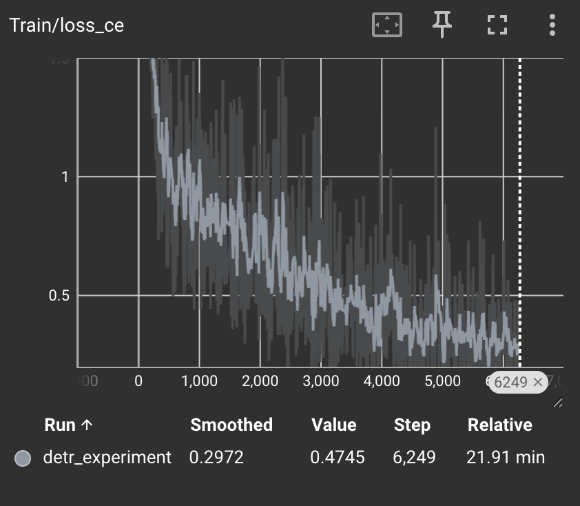
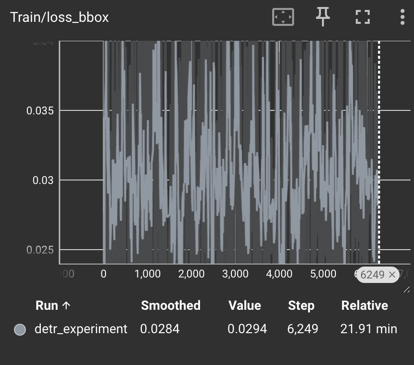
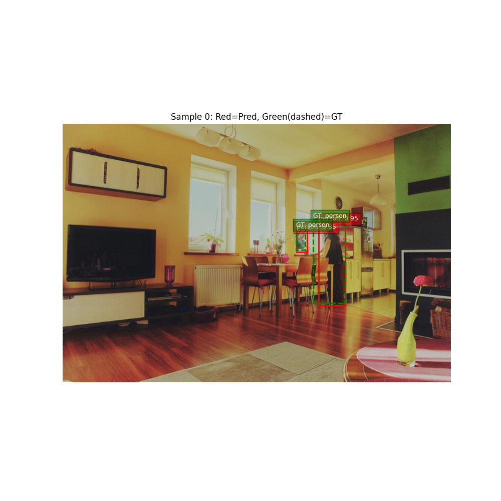
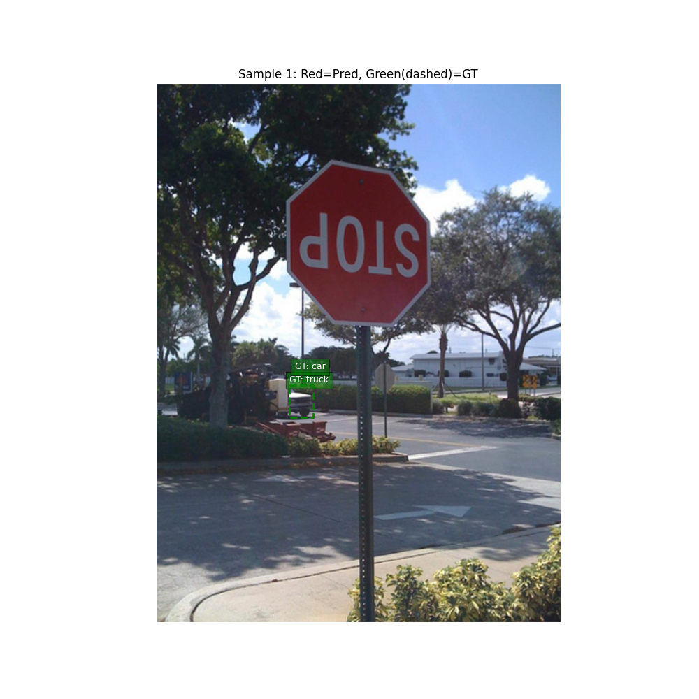
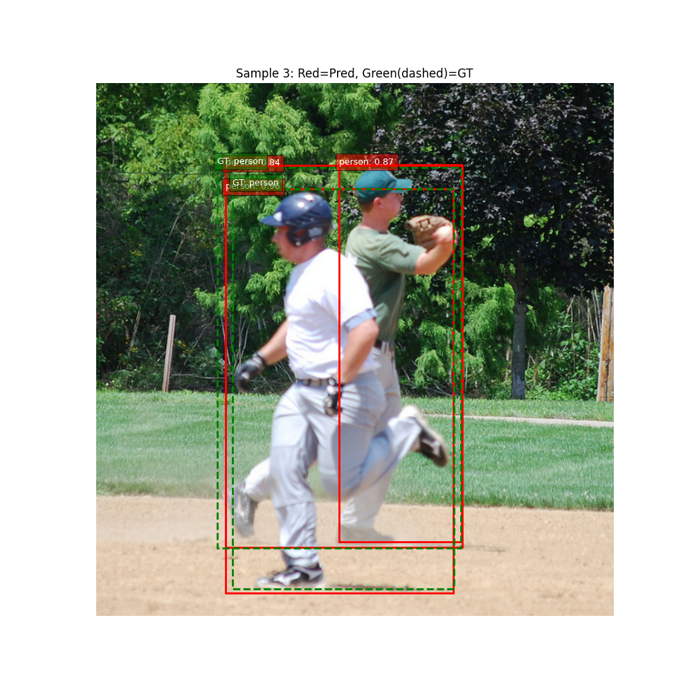
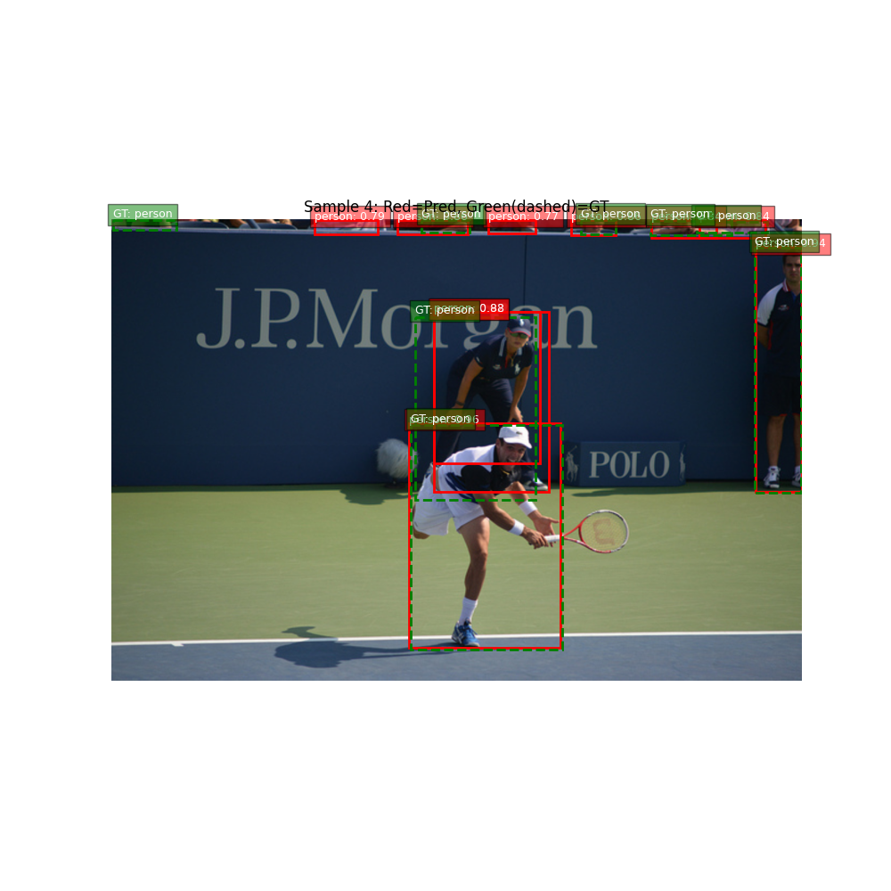

## HW2

Этот репозиторий содержит код для fine-tuning модели **DETR (DEtection TRansformer)** на подмножестве датасета COCO (10 классов).

### Структура проекта
*   `src/dataset.py`: Логика загрузки данных, фильтрация классов и `Collator` для паддинга батчей.
*   `src/train.py`: Основной цикл обучения, логирование в TensorBoard, профилирование (PyTorch Profiler).
*   `src/analyze.py`: Скрипт для валидации, визуализации предсказаний и анализа ошибок.
*   `download_coco.py`: Скрипт для скачивания нужного подмножества данных (через `fiftyone`).
*   `requirements.txt`: Список зависимостей.

---

### Запуск и установка

#### 1. Установка зависимостей
```bash
pip install -r requirements.txt
pip install fiftyone
```

#### 2. Подготовка данных
Используется подмножество COCO 2017. Выбраны следующие 10 классов:
`['person', 'car', 'bicycle', 'bus', 'truck', 'traffic light', 'stop sign', 'cat', 'dog', 'chair']`.

Чтобы скачать данные (займет ~2-3 ГБ):
```bash
python download_coco.py
```
Данные будут сохранены в папку `data/`.

#### 3. Обучение
Запуск тренировочного цикла:
```bash
python train.py
```
*   Логи сохраняются в `runs/`.
*   Чекпоинты сохраняются в `checkpoints/`.

#### 4. Анализ ошибок
После обучения запустите скрипт анализа для генерации визуализаций на валидационной выборке:
```bash
python analyze.py
```
Результаты сохранятся в папку `runs/` в виде изображений `analysis_N.png`.

---

### Параметры эксперимента

Для обучения использовалась предобученная модель `facebook/detr-resnet-50`. Последний полносвязный слой (classification head) был заменен на слой с 10 выходами (+1 для "no object").

**Гиперпараметры:**
*   **Batch Size:** 4 (Ограничение памяти VM)
*   **Learning Rate:** 1e-5 (Transformer)
*   **Epochs:** 10
*   **Optimizer:** AdamW
---

###  Результаты и Loss Analysis

Мониторинг обучения проводился через TensorBoard.
Команда для просмотра: `tensorboard --logdir=runs`

#### Графики потерь (Loss Curves)
Loss ce



Loss bbox




**Наблюдения:**
1.  **Total Loss:** Демонстрирует общий тренд на снижение.
2.  **Components:**
    *   `loss_ce` (Classification): Падает быстрее всего — модель быстро учится отличать собаку от машины.
    *   `loss_bbox` (Regression): Падает медленнее, так как точная подгонка границ объекта — более сложная задача для трансформера.
---

### 🔍 Error Analysis (Анализ ошибок)

Пример работы модели на валидационной выборке(красное - результат модели, зеленое - ожидаемый результат):





**Ошибки:**
1.  **Localization Error:** Модель верно определяет объект (например, `car`), но bounding box смещен или покрывает объект не полностью (низкий IoU).




2.  **Small Objects:** DETR испытывает трудности с детекцией мелких объектов на заднем плане (например, удаленные `truck`).
